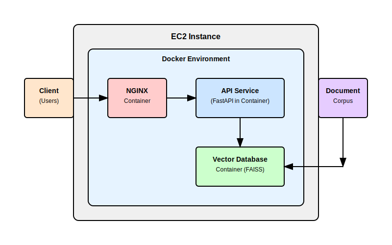
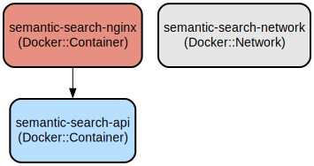

# Semantic Search API: Fast and Accurate Document Search with FAISS and Sentence Transformers

This project implements a high-performance semantic search API that enables natural language document search using FAISS (Facebook AI Similarity Search) and Sentence Transformers. It provides fast and accurate document retrieval based on semantic meaning rather than exact keyword matching.

The system processes documents to create vector embeddings using state-of-the-art language models, builds an efficient search index, and exposes a REST API for performing semantic searches. The architecture is containerized using Docker and includes performance monitoring, making it suitable for both development and production environments.

## Repository Structure
```
.
├── api/                           # Core API implementation
│   ├── document_processor.py      # Document processing and search logic
│   └── main.py                   # FastAPI application entry point
├── scripts/
│   └── build_index.py            # CLI tool for building search indices
├── docker-compose.yml            # Docker services configuration
├── requirements.txt              # Python package dependencies
├── local_testing_guide.md        # Local development instructions
├── semantic_search_ec2_guide.md  # AWS EC2 deployment guide
└── tests/                        # Test suite
    ├── test_csv_loading.py       # CSV import testing
    ├── test_end_to_end.py       # Integration tests
    ├── test_performance.py       # Performance benchmarks
    ├── test_processor.py         # Core processor unit tests
    └── test_verify_memory_usage.py # Memory profiling tests
```

## Usage Instructions
### Prerequisites
- Python 3.8 or higher
- Docker and Docker Compose
- 4GB RAM minimum (8GB recommended)
- CUDA-compatible GPU (optional, for improved performance)

Required Python packages:
```
fastapi>=0.103.1
uvicorn>=0.23.2
sentence-transformers>=2.2.2
faiss-cpu>=1.7.0
pandas>=2.2.0
numpy>=1.25.2
scikit-learn>=1.3.0
```

### Installation

#### Local Installation
```bash
# Clone the repository
git clone <repository-url>
cd semantic-search-api

# Create and activate virtual environment
python -m venv venv
source venv/bin/activate  # On Windows: venv\Scripts\activate

# Install dependencies
pip install -r requirements.txt
```

#### Docker Installation
```bash
# Build and start services
docker-compose up -d

# Verify services are running
docker-compose ps
```

### Quick Start
1. Prepare your documents in CSV format with at least a 'text' column:
```python
import pandas as pd
documents = [
    {"text": "First document content"},
    {"text": "Second document content"}
]
pd.DataFrame(documents).to_csv('documents.csv', index=False)
```

2. Build the search index:
```bash
python scripts/build_index.py --csv documents.csv --text-column text
```

3. Start the API server:
```bash
uvicorn api.main:app --host 0.0.0.0 --port 8000
```

4. Perform a search:
```bash
curl -X POST "http://localhost:8000/search" \
     -H "Content-Type: application/json" \
     -d '{"query": "your search query", "top_k": 5}'
```

### More Detailed Examples

#### Custom Document Processing
```python
from api.document_processor import DocumentProcessor

# Initialize with custom model
processor = DocumentProcessor(model_name='all-MiniLM-L6-v2')

# Add documents directly
documents = ["First document", "Second document"]
processor.add_documents(documents)

# Create embeddings and build index
processor.create_embeddings()
processor.build_faiss_index()

# Perform search
results = processor.search("query text", top_k=3)
```

### Troubleshooting

#### Common Issues

1. Index Building Fails
```
Error: No embeddings available. Run create_embeddings() first.
```
Solution:
```python
processor.create_embeddings()  # Must be called before build_faiss_index()
```

2. Memory Issues
- Symptom: Process killed during embedding creation
- Solution: Reduce batch size or use chunked processing:
```python
# Process in smaller batches
chunk_size = 1000
for i in range(0, len(documents), chunk_size):
    chunk = documents[i:i+chunk_size]
    processor.add_documents(chunk)
    processor.create_embeddings()
```

3. Performance Optimization
- Monitor memory usage: `python test_verify_memory_usage.py`
- Enable GPU acceleration by installing `faiss-gpu` instead of `faiss-cpu`
- Adjust model size vs. performance tradeoff by selecting different models

## Data Flow
The system processes documents through a pipeline that converts text into searchable vector embeddings using Sentence Transformers and FAISS indexing.

```
[Documents] -> [Document Processor] -> [Embeddings] -> [FAISS Index] -> [Search API]
     │                │                    │               │               │
     └─ CSV Input     └─ Text Processing   └─ Vectors     └─ Similarity  └─ Results
```

Key component interactions:
1. DocumentProcessor loads and validates input documents
2. SentenceTransformer creates dense vector embeddings
3. FAISS builds an efficient similarity search index
4. FastAPI exposes RESTful search endpoints
5. Nginx handles request routing and load balancing

## Architecture

```
                  ┌────────────────────────────────────────────────┐
                  │             EC2 Instance                       │
                  │                                                │
┌──────────┐      │  ┌──────────────────────────────────────────┐  │      ┌───────────┐
│  Client  │      │  │           Docker Environment             │  │      │ Document  │
│ (Users)  │──────┼──►                                          │  │      │  Corpus   │
└──────────┘      │  │  ┌─────────────┐      ┌──────────────┐   │  │      └─────┬─────┘
                  │  │  │   NGINX     │      │  API Service  │   │  │            │
                  │  │  │  Container  │──────► (FastAPI in   │   │  │            │
                  │  │  │             │      │   Container)  │   │  │            │
                  │  │  └─────────────┘      └──────┬───────┘   │  │            │
                  │  │                              │           │  │            │
                  │  │                       ┌──────▼───────┐   │  │            │
                  │  │                       │   Vector     │◄──┼──┼────────────┘
                  │  │                       │  Database    │   │  │
                  │  │                       │  Container   │   │  │
                  │  │                       │  (FAISS)     │   │  │
                  │  │                       └──────────────┘   │  │
                  │  │                                          │  │
                  │  └──────────────────────────────────────────┘  │
                  │                                                │
                  └────────────────────────────────────────────────┘
```



## Infrastructure


The application runs in two Docker containers:

### API Service
- Container: semantic-search-api
- Mounts: ./data:/app/data
- Environment: DATA_DIR=/app/data

### Nginx Service
- Container: semantic-search-nginx
- Ports: 80:80
- Configuration: Custom nginx.conf
- Dependencies: API service

Network: semantic-search-network (bridge driver)